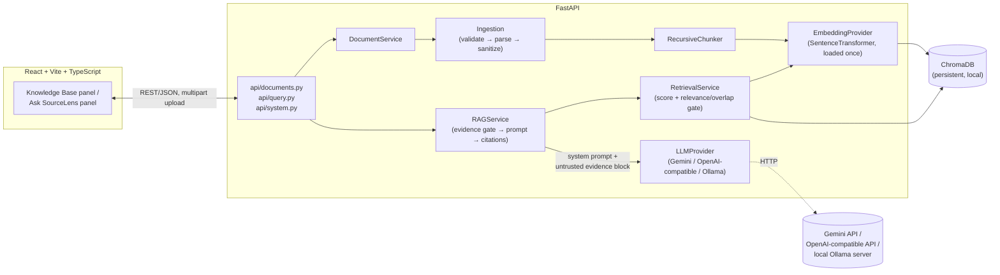

# Architecture

## Component overview



## Backend layout

```
backend/app/
  api/            FastAPI routers: documents, query, system (health/config)
  core/           constants, exceptions, logging, shared text utilities
  models/         domain dataclasses/pydantic models (DocumentMeta, Chunk, ...)
  repositories/   ChromaStore - the only module that talks to ChromaDB
  schemas/        request/response pydantic schemas
  services/
    ingestion/    validate → parse (PDF/DOCX/TXT/MD) → sanitize filenames
    chunking/     recursive text splitter with overlap
    embeddings/   EmbeddingProvider interface; SentenceTransformer + a
                  deterministic hash provider for offline tests
    llm/          LLMProvider interface; Gemini/OpenAI-compatible/Ollama
                  implementations + a factory that reads Settings
    retrieval/    turns a query into a ranked, gated evidence set
    rag/          orchestrates retrieval → evidence gate → LLM → citations;
                  owns the system prompt and the trust-boundary framing
  config.py       pydantic-settings Settings, read from environment/.env
  container.py    wires the above into one Container per app instance
  main.py         FastAPI app factory, CORS, error handlers
```

`container.py` is the composition root: `build_container(settings)` builds
the real pipeline (real embeddings, real configured LLM), and
`build_hash_container(settings)` swaps in the deterministic hash embedding
provider for fast, offline, dependency-free tests. Tests never patch
internals — they build a real `Container` with a real (if fake) embedding
provider and a `MockLLMProvider`, and exercise the actual FastAPI app via
`TestClient`. This is why `backend/tests/` catches real integration bugs
(e.g. the Chroma top-k/telemetry issues found during this recovery) rather
than only testing functions in isolation.

## Frontend layout

```
frontend/src/
  components/   KnowledgeBasePanel, UploadDropzone, DocumentCard,
                QueryPanel, AnswerView, SourceCard, Header, StatusBadge
  hooks/        useDocuments (list/upload/delete), useQuery (ask)
  services/     api.ts - the only module that calls the backend
  pages/Home.tsx  composes the two panels + health/config polling
  types/        TypeScript types mirroring the backend's pydantic schemas
```

State lives in two hooks (`useDocuments`, `useQuery`); components are
presentational and receive state + callbacks as props. There's no global
state library — the app is small enough that prop drilling through two
levels is clearer than adding one.

## Why a container instead of module-level singletons

`app/main.py`'s `create_app()` accepts an optional pre-built `Container`.
Production startup builds one from `Settings()` via the FastAPI lifespan
hook; tests build their own with a temp Chroma directory and a
`MockLLMProvider`, then pass it directly to `create_app()`. This is what
lets `backend/tests/conftest.py` spin up a fully real FastAPI app (routing,
middleware, error handlers, the works) per test without touching the
developer's real `backend/data/chroma` or requiring network access or a
downloaded model.

## Data flow at a glance

See [RAG_PIPELINE.md](RAG_PIPELINE.md) for the detailed step-by-step flow,
including exactly where the evidence-sufficiency gate sits and why it's
positioned before the LLM is ever called.
